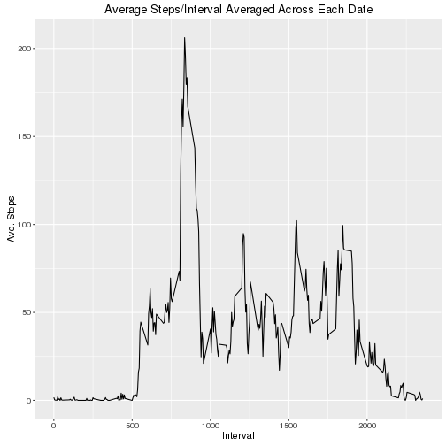
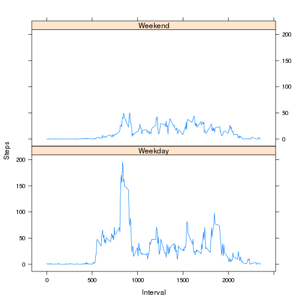

Reproducible Research: Project 1, Week 2
===========================================================
##### Author:R Phelps.
##### Date:  May 14, 2016  

### Data location
#### https://github.com/rlphelps/RepData_PeerAssessment1
#### file: activity.zip

### Begin Code
#### Load needed libraries: Use Hadley's libs for manipulating and plotting plus the timeDate and lattice plotting libs

```r
library(dplyr)
library(ggplot2)
library(timeDate)
library(lattice)
```

#### Read data into a dataframe and change dataframe into a table

```r
activity<- tbl_df(read.csv('data/activity.csv'))
```
#### Generate a histogram of the total number of steps taken each day

```r
gb_dates = group_by(activity, date)
steps_per_day = summarise(gb_dates, totalsteps  = sum(steps))
qplot(steps_per_day$totalsteps,geom = 'histogram', 
      main = 'Histogram of Total Steps/Date', 
      xlab = 'Total Steps', ylab = 'Qty of Dates',
      ylim = c(0,10), binwidth = 500)
```


#### Find the mean and median of the number of steps taken each day. I removed NA's first

```r
steps_per_day = na.omit(steps_per_day$totalsteps)
paste('Mean steps per day:',mean(steps_per_day))
paste('Median steps per day:',median(steps_per_day))
```

```
## [1] "Mean steps per day: 10766.1886792453"
## [1] "Median steps per day: 10765"
```
#### Generate a time series plot of the average number of steps per interval averaged across each day


```r
activity_no_na = na.omit(activity)
gb_interval = group_by(activity_no_na, interval)
total_days = 53 # 53 days in dataset
steps_per_interval = summarise(gb_interval, interval_step_ave = sum(steps)/total_days)
qplot(steps_per_interval$interval, steps_per_interval$interval_step_ave, geom = 'line',
      main = 'Average Steps/Interval Averaged Across Each Date',
      xlab = 'Interval', ylab = 'Ave. Steps')
```



#### Find the 5 minute interval that contins the maximum average number of steps


```r
result = filter(steps_per_interval, interval_step_ave == max(interval_step_ave))
print(paste('Interval with Maximum Average Steps:', result$interval))
```

```
## [1] "Interval with Maximum Average Steps: 835"
```

## Imputing missing data
#### Find the number of NA's for reference
#### Locate the intervals with NA's and then replace them with the average of that interval from all other days that was generated in the code above

```r
Qty = sum(is.na(activity$steps))
print(paste("Qty. of NA's in dataset", Qty))
```

```
## [1] "Qty. of NA's in dataset 2304"
```

####Iterate through dataframe checking for NA's then retrieve the interval number and the step_ave_for that interval number and insert it in place of the NA value.


```r
# note that AVE step value is left as floating point to easily identify it 
# in updated activity dataframe
for (index in 1:nrow(activity)){ 
    if (is.na(activity[index,]$steps)) {         # if steps value == NA 
      intervalnum = activity[index,]$interval    # retrieve interval number 
      # retrieve ave step value for interval number
      imputedlookup = filter(steps_per_interval, steps_per_interval$interval == intervalnum)
      # stuff ave step value into activity dataframe
      activity[index,]$steps = print(imputedlookup$interval_step_ave)
     }
}
```
#### Histogram plot again of the steps/date
#### Made sure to make bin width and y-axis the same as previous histogram to make comparison easy


```r
gb_dates = group_by(activity, date)
steps_per_day = summarise(gb_dates, totalsteps  = sum(steps))
qplot(steps_per_day$totalsteps,geom = 'histogram', 
      main = 'Histogram of Total Steps/Date', 
      xlab = 'Total Steps', ylab = 'Qty of Dates',
      ylim = c(0,10), binwidth = 500)
```


#### Regroup new activity dataframe and calcluate the mean and median step values

```r
gb_dates = group_by(activity, date)
steps_per_day = summarise(gb_dates, totalsteps  = sum(steps))
```
#### Mean and median values now the same
#### Impact of imputing data on estimations of total daily steps is minimal

### Investigate the activities on Weekends and Weekdays
#### Mutate activity frame (with imputed NA's) to include a boolean col using 'isWeekday()'. Mutate again to create factor col with 'Weekday' and 'Weekend' as factors

```r
activity = mutate(activity, wk_day_end_bool = isWeekday(date))
activity = mutate(activity, wkday_or_wkend = 
                  as.factor( ifelse(wk_day_end_bool, 'Weekday', 'Weekend')))
```
#### Dataframe activity now looks like this

```
## Source: local data frame [5 x 5]
## 
##       steps       date interval wk_day_end_bool wkday_or_wkend
##       (dbl)     (fctr)    (int)           (lgl)         (fctr)
## 1 1.7169811 2012-10-01        0            TRUE        Weekday
## 2 0.3396226 2012-10-01        5            TRUE        Weekday
## 3 0.1320755 2012-10-01       10            TRUE        Weekday
## 4 0.1509434 2012-10-01       15            TRUE        Weekday
## 5 0.0754717 2012-10-01       20            TRUE        Weekday
```

#### The following is a panel plot containing a time series of the 5-minute intervals and the average number of steps
#### Split the activity dataframe into two dataframes by weekday/end factor
#### Group by interval then average the number of steps per interval over all days

```r
Weekend = filter(activity, wkday_or_wkend == 'Weekend')  # split out Weekend data
Weekday = filter(activity, wkday_or_wkend == 'Weekday')  # split out Weekday data
Wkend_ntrvl = group_by(Weekend, interval)                # groupby intervals
Wkday_ntrvl = group_by(Weekday, interval)
total_days = 53 # 53 days in dataset

# Average steps/interval for Weekend & Weekday
Wkend_steps_per_ntrvl = summarise(Wkend_ntrvl, interval_step_ave = sum(steps)/total_days)
Wkday_steps_per_ntrvl = summarise(Wkday_ntrvl, interval_step_ave = sum(steps)/total_days)
```

#### Put interval averages for Weekend and Weekday into one dataframe and  create factor vectors to add to Wkday/Wkend_steps_per_trvl
#### Then bind two dataframe together and plot using lattice xyplot with type line

```r
Wkend_steps_per_ntrvl['wkday_or_wkend'] = 
        rep(as.factor('Weekend'),nrow(Wkend_steps_per_ntrvl))
Wkday_steps_per_ntrvl['wkday_or_wkend'] = 
        rep(as.factor('Weekday'),nrow(Wkday_steps_per_ntrvl))

final_data = rbind(Wkday_steps_per_ntrvl, Wkend_steps_per_ntrvl)

xyplot(interval_step_ave~interval | factor(wkday_or_wkend), data=final_data,
                 xlab="Interval", ylab="Steps",layout=c(1,2),type='l')
```




